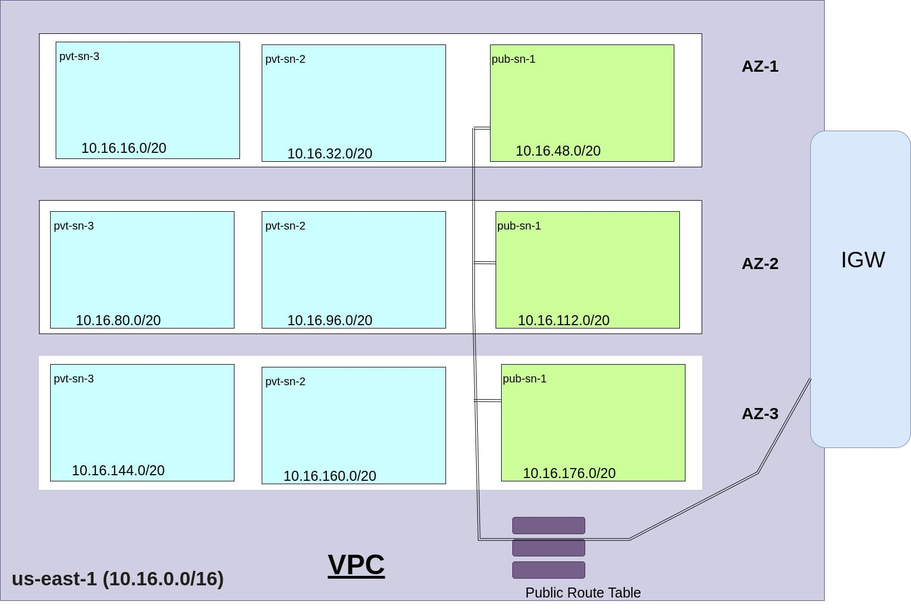

# cutom_vpc_by_terraform_IaaC

1. This repository contains two modules---> One Jupiter Second Module/VPC

    * They create a multi-tier VPC architecture in AWS via IaaC (Terraform)
    * It uses three Availability zones (AZ-1, AZ-2, AZ-3) in "US-EAST-1" Region
    * It houses One Public subnet and two private subnet in each Availability Zone.
    * It also create one Internet-Gateway with a Public route-Table attached to IGW and Public subnets

2. Resources it creates
    1. VPC-----> cidr_block (10.16.0.0/16)
    2. Availability Zones-------> 3
    3. Subnets------> One Public and Two Private / Availability Zones
            Cidr_block for them are 
                    # AZ1
                    pvt_db_az1_cidr = "10.16.16.0/20"
                    pvt_sn_az1_cidr = "10.16.32.0/20"
                    pb_sn_az1_cidr  = "10.16.48.0/20"
                    #------------------------------
                    # AZ2   
                    pvt_db_az2_cidr = "10.16.80.0/20"
                    pvt_sn_az2_cidr = "10.16.96.0/20"
                    pb_sn_az2_cidr  = "10.16.112.0/20"
                    #--------------------------------
                    # AZ3
                    pvt_db_az3_cidr = "10.16.144.0/20"
                    pvt_sn_az3_cidr = "10.16.160.0/20"
                    pb_sn_az3_cidr  = "10.16.176.0/20"

    4. Internet-Gateway
    5. Public Route-Table----> Attached with all Public subnets in all Availability Zones to Internet-Gateway